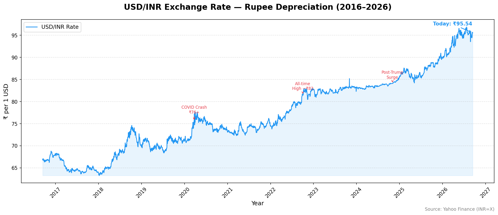
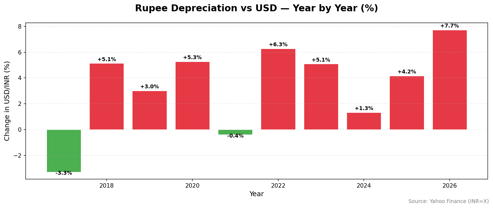

# 💱 USD/INR Forex Tracker

A Python tool that fetches **live USD/INR exchange rate data** and visualizes the rupee's depreciation journey from 2016 to 2026 — including year-by-year breakdown and key economic event annotations.

> 📍 Current Rate: ₹94.87 | All-time High: ₹95.26 | 5-Year Depreciation: +28.9%

---

## 📊 Charts

### USD/INR Rate History (2016–2026)


### Year-by-Year Rupee Depreciation (%)


---

## 🔍 What This Shows

- **2020 COVID crash** → Rupee hit ₹76+ as global markets collapsed
- **2022 surge** → Aggressive Fed rate hikes pushed USD/INR to ₹83
- **2024–25** → Post-Trump dollar surge, rupee near all-time lows at ₹95
- **5-year story** → Rupee has lost **28.9% of its value** against the dollar since 2020

---

## 🚀 How to Run

### 1. Clone the repo
```bash
git clone https://github.com/baalu-xbt/usdinr-forex-tracker.git
cd usdinr-forex-tracker
```

### 2. Create virtual environment
```bash
python -m venv venv
venv\Scripts\activate      # Windows
source venv/bin/activate   # Mac/Linux
```

### 3. Install dependencies
```bash
pip install -r requirements.txt
```

### 4. Run the tracker
```bash
python main.py
```

---

## 📁 Project Structure

```
usdinr-forex-tracker/
│
├── main.py              ← Entry point
├── requirements.txt
├── README.md
│
├── src/
│   ├── fetcher.py       ← Fetches live USD/INR data via yfinance
│   └── visualizer.py   ← Generates forex charts
│
└── output/
    └── charts/          ← Generated PNG charts
```

---

## 🛠️ Tech Stack

- **Python 3.13**
- **yfinance** — live forex data from Yahoo Finance
- **pandas** — data wrangling
- **matplotlib** — chart generation

---

## 📦 Data Source

Live and historical USD/INR exchange rate data sourced from **Yahoo Finance** (`INR=X` ticker) via the `yfinance` library — updated daily.

---

## 🔮 Roadmap

- [ ] Overlay RBI repo rate decisions on forex chart
- [ ] Add EUR/INR and GBP/INR comparison
- [ ] Volatility analysis during RBI intervention periods
- [ ] Email/SMS alert when rate crosses threshold

---

## 🔗 Related Project

- [RBI Monetary Policy Tracker](https://github.com/baalu-xbt/rbi-policy-visualizer-app) — tracks 90 years of RBI rate decisions

---

## 👤 Author

Built by **Balaji K** — connect on [LinkedIn](https://www.linkedin.com/in/balaji-k-58a3932ab) | [GitHub](https://github.com/baalu-xbt)
